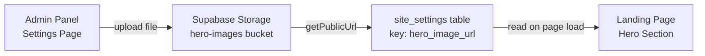

# Admin Hero Photo Upload via Supabase Storage
i
## Overview

Allow admin users to upload and manage the hero section background photo from the admin panel. The image is stored in a **public Supabase Storage bucket** and the URL is persisted in a `site_settings` key-value table. The landing page reads the URL from DB, falling back to the current hardcoded Unsplash image.

## Problem Statement / Motivation

The hero image is hardcoded as an Unsplash URL in `src/components/MarketingCourseLanding.tsx:446`. Changing it requires a code deploy. Admin users should be able to update the hero photo directly from the UI.

## Proposed Solution



### Key decisions:
- **Public bucket** (`hero-images`) — no signed URLs needed, works with Next.js Image
- **`site_settings` table** (key-value) — stores `hero_image_url` value, extensible for future settings
- **Fallback** — if no DB value, the current Unsplash URL is used
- **Single file** — uploading a new image replaces the old one (upsert to `hero.webp`)
- **Client-side upload** — admin uploads directly to Supabase Storage via browser client (no API route needed)

## Acceptance Criteria

- [ ] Admin can navigate to a "Settings" page in the admin panel
- [ ] Admin sees the current hero image as a preview
- [ ] Admin can click to select and upload a new image (max 5MB, images only)
- [ ] Upload shows loading state and error handling
- [ ] After upload, the landing page hero section displays the new image
- [ ] If no custom image is set, the Unsplash fallback is used
- [ ] Navigation updated: AdminNavbar and MobileBottomNav include "Settings" tab

## Technical Approach

### Phase 1: Database & Storage Setup

#### 1.1 Create `site_settings` table (SQL migration)

```sql
-- supabase/migrations/XXXXXX_create_site_settings.sql
CREATE TABLE IF NOT EXISTS site_settings (
  key TEXT PRIMARY KEY,
  value TEXT NOT NULL,
  updated_at TIMESTAMPTZ DEFAULT now()
);

ALTER TABLE site_settings ENABLE ROW LEVEL SECURITY;

-- Admins can read/write
CREATE POLICY "Admins can manage site_settings"
  ON site_settings FOR ALL
  USING (is_admin())
  WITH CHECK (is_admin());

-- Public can read (landing page needs this via server component)
CREATE POLICY "Public can read site_settings"
  ON site_settings FOR SELECT
  USING (true);
```

#### 1.2 Create `hero-images` Storage bucket (Supabase Dashboard or SQL)

```sql
-- Create a public bucket for hero images
INSERT INTO storage.buckets (id, name, public, file_size_limit, allowed_mime_types)
VALUES (
  'hero-images',
  'hero-images',
  true,
  5242880, -- 5MB
  ARRAY['image/jpeg', 'image/png', 'image/webp', 'image/avif']
);

-- RLS: only admins can upload/delete
CREATE POLICY "Admins can upload hero images"
  ON storage.objects FOR INSERT
  WITH CHECK (bucket_id = 'hero-images' AND (SELECT is_admin()));

CREATE POLICY "Admins can update hero images"
  ON storage.objects FOR UPDATE
  USING (bucket_id = 'hero-images' AND (SELECT is_admin()));

CREATE POLICY "Admins can delete hero images"
  ON storage.objects FOR DELETE
  USING (bucket_id = 'hero-images' AND (SELECT is_admin()));

-- Public can read (it's a public bucket, but explicit policy)
CREATE POLICY "Public can read hero images"
  ON storage.objects FOR SELECT
  USING (bucket_id = 'hero-images');
```

#### 1.3 Update `src/types/database.ts`

Add `SiteSetting` type and update `Database`:

```typescript
// src/types/database.ts
export interface SiteSetting {
  key: string;
  value: string;
  updated_at: string;
}

// Add to Database.public.Tables:
site_settings: {
  Row: SiteSetting;
  Insert: { key: string; value: string };
  Update: { value?: string; updated_at?: string };
};
```

### Phase 2: Admin UI — Settings Page

#### 2.1 Create `src/app/admin/settings/page.tsx` (Server Component)

- Fetch current `hero_image_url` from `site_settings` table
- Pass to `HeroImageUploader` client component
- Match existing admin page pattern (like `reviews/page.tsx`)

```typescript
// src/app/admin/settings/page.tsx
import { createClient } from '@/lib/supabase/server';
import HeroImageUploader from '@/components/admin/HeroImageUploader';

export default async function SettingsPage() {
  const supabase = await createClient();
  const { data } = await supabase
    .from('site_settings')
    .select('value')
    .eq('key', 'hero_image_url')
    .single();

  return (
    <div className="space-y-8">
      <h1 className="text-3xl font-bold">Налаштування сайту</h1>
      <HeroImageUploader currentImageUrl={data?.value || null} />
    </div>
  );
}
```

#### 2.2 Create `src/components/admin/HeroImageUploader.tsx` (Client Component)

Core upload component with:

- **Image preview** — shows current hero image (or placeholder)
- **File input** — hidden, triggered by styled button; accepts `image/*`
- **Client-side validation** — max 5MB, image MIME types only
- **Upload flow**: file → `supabase.storage.from('hero-images').upload('hero.webp', file, { upsert: true })` → `getPublicUrl` → upsert to `site_settings`
- **Loading/error states** — spinner during upload, error banner on failure
- **Uses GlassCard** for consistent admin design

```typescript
// src/components/admin/HeroImageUploader.tsx
'use client';

import { useState, useRef } from 'react';
import { useRouter } from 'next/navigation';
import Image from 'next/image';
import { createClient } from '@/lib/supabase/client';
import { Upload, Loader2, ImageIcon, Trash2 } from 'lucide-react';
import GlassCard from './GlassCard';

const FALLBACK_IMAGE = 'https://images.unsplash.com/photo-1573496359142-b8d87734a5a2?q=80&w=1288&auto=format&fit=crop';
const MAX_FILE_SIZE = 5 * 1024 * 1024; // 5MB

interface HeroImageUploaderProps {
  currentImageUrl: string | null;
}
```

**Upload handler logic:**
1. Validate file size & type on client
2. Upload to `hero-images` bucket with `upsert: true` (always overwrite `hero.webp`)
3. Get public URL via `getPublicUrl()`
4. Upsert `site_settings` row: `{ key: 'hero_image_url', value: publicUrl }`
5. Call `router.refresh()` to update server component data

**Delete handler logic:**
1. Remove file from storage bucket
2. Delete `site_settings` row where `key = 'hero_image_url'`
3. Call `router.refresh()`

#### 2.3 Update Navigation

**`src/components/admin/AdminNavbar.tsx`** — Add Settings to `NAV_ITEMS`:

```typescript
import { Settings } from 'lucide-react';

// Add to NAV_ITEMS array:
{ id: '/admin/settings', label: 'Налаштування', icon: Settings },
```

**`src/components/admin/MobileBottomNav.tsx`** — Add Settings:

```typescript
import { Settings } from 'lucide-react';

// Add to NAV_ITEMS array:
{ href: '/admin/settings', icon: Settings },
```

### Phase 3: Landing Page Integration

#### 3.1 Update `src/app/page.tsx`

Fetch `hero_image_url` from `site_settings` and pass to component:

```typescript
// Add to existing server-side data fetching:
const { data: heroSetting } = await supabase
  .from('site_settings')
  .select('value')
  .eq('key', 'hero_image_url')
  .single();

return (
  <MarketingCourseLanding
    reviews={(data as Review[]) || []}
    heroImageUrl={heroSetting?.value || undefined}
  />
);
```

#### 3.2 Update `src/components/MarketingCourseLanding.tsx`

- Add `heroImageUrl?: string` to component props
- Replace hardcoded Unsplash URL with `heroImageUrl || FALLBACK_URL` at line ~446

```typescript
// Props update:
interface MarketingCourseLandingProps {
  reviews: Review[];
  heroImageUrl?: string;
}

// Line ~446 change:
src={heroImageUrl || 'https://images.unsplash.com/photo-1573496359142-b8d87734a5a2?q=80&w=1288&auto=format&fit=crop'}
```

### Phase 4: Next.js Config

#### 4.1 Update `next.config.ts`

Add Supabase Storage hostname to `remotePatterns`. The hostname is derived from `NEXT_PUBLIC_SUPABASE_URL` — typically `<project-ref>.supabase.co`:

```typescript
// next.config.ts — add to remotePatterns:
{
  protocol: 'https',
  hostname: '*.supabase.co',
},
```

## Files to Create/Modify

| Action | File | Description |
|--------|------|-------------|
| **Create** | `src/app/admin/settings/page.tsx` | Settings page (server component) |
| **Create** | `src/components/admin/HeroImageUploader.tsx` | Upload component (client) |
| Modify | `src/types/database.ts` | Add `SiteSetting` type |
| Modify | `src/components/admin/AdminNavbar.tsx` | Add Settings nav item |
| Modify | `src/components/admin/MobileBottomNav.tsx` | Add Settings nav item |
| Modify | `src/app/page.tsx` | Fetch hero image URL |
| Modify | `src/components/MarketingCourseLanding.tsx` | Accept `heroImageUrl` prop |
| Modify | `next.config.ts` | Add Supabase Storage domain |

## Dependencies & Risks

- **Supabase Storage bucket must be created manually** (or via SQL migration) in the Supabase dashboard before the feature works
- **RLS policies** must be applied — the `is_admin()` function already exists
- **No new npm packages required** — `@supabase/supabase-js` already includes storage methods
- **Cache**: Supabase Storage serves with `cache-control` headers. Using a fixed filename (`hero.webp`) with `upsert: true` means the URL stays the same after re-upload — browser cache may need a cache-busting query param (`?t=timestamp`) appended

## References

- Existing admin page pattern: `src/app/admin/reviews/page.tsx`
- Existing client component pattern: `src/components/admin/ReviewEditor.tsx`
- Supabase browser client: `src/lib/supabase/client.ts`
- Supabase server client: `src/lib/supabase/server.ts`
- Database types: `src/types/database.ts`
- Hero image location: `src/components/MarketingCourseLanding.tsx:446`
- Next.js image config: `next.config.ts`
