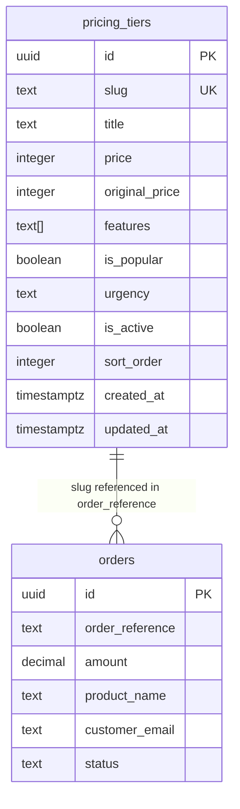

# Admin Pricing Management

## Overview

Move pricing tiers from hardcoded constants to a Supabase `pricing_tiers` table with full CRUD management from a dedicated `/admin/pricing` page. Both the landing page display and the WayForPay payment API will read from the database, establishing a single source of truth for all pricing data.

## Problem Statement

Pricing is currently hardcoded in **two separate places with diverging values**:

| Source | File | Prices (UAH) | Used By |
|---|---|---|---|
| Payment API | `src/lib/pricing.ts` | 5, 5, 5 (test) | `POST /api/wayforpay` |
| Display | `MarketingCourseLanding.tsx:138-182` | 799, 7999, 12999 | Landing page UI |

This creates data integrity issues (users see one price, get charged another), requires code deployments to change prices, and prevents non-developers from managing pricing.

## Proposed Solution

1. Create a `pricing_tiers` table in Supabase
2. Build `/admin/pricing` page following the existing Reviews CRUD pattern
3. Refactor landing page and payment API to read from the database
4. Seed the table with production values from the `MarketingCourseLanding.tsx` inline data
5. Delete the hardcoded `src/lib/pricing.ts` file

## Technical Approach

### Phase 1: Database Layer

#### Migration: `supabase/migrations/003_pricing_tiers.sql`

```sql
CREATE TABLE pricing_tiers (
  id UUID PRIMARY KEY DEFAULT gen_random_uuid(),
  slug TEXT NOT NULL UNIQUE CHECK (slug ~ '^[a-z0-9-]+$'),
  title TEXT NOT NULL,
  price INTEGER NOT NULL CHECK (price > 0),
  original_price INTEGER NOT NULL CHECK (original_price > 0),
  features TEXT[] NOT NULL DEFAULT '{}',
  is_popular BOOLEAN DEFAULT false,
  urgency TEXT,
  is_active BOOLEAN DEFAULT true,
  sort_order INTEGER DEFAULT 0,
  created_at TIMESTAMPTZ DEFAULT NOW(),
  updated_at TIMESTAMPTZ DEFAULT NOW()
);

ALTER TABLE pricing_tiers ENABLE ROW LEVEL SECURITY;

CREATE POLICY "Admin full access" ON pricing_tiers
  FOR ALL USING (is_admin()) WITH CHECK (is_admin());

CREATE POLICY "Public read active" ON pricing_tiers
  FOR SELECT USING (is_active = true);

-- Seed existing tiers (production values from MarketingCourseLanding.tsx)
INSERT INTO pricing_tiers (slug, title, price, original_price, features, is_popular, urgency, sort_order)
VALUES
  ('basic', 'Базовий', 799, 1200,
   ARRAY['Доступ до 12 модулів', 'Шаблони стратегій', 'Доступ до чату учнів', 'Сертифікат про завершення'],
   false, NULL, 0),
  ('premium', 'Преміум', 7999, 12800,
   ARRAY['Все з Базового', '2 групові сесії зі мною', 'Перевірка ДЗ кураторами', 'Закритий чат з фахівцями', 'Бонус: гайд по креативах', 'Доступ на 12 місяців'],
   true, NULL, 1),
  ('vip', 'VIP', 12999, 19999,
   ARRAY['Все з Преміум', 'Особистий менторинг (3 зустрічі)', 'Аудит твоєї поточної реклами', 'Розробка стратегії під ключ', 'Пріоритетна підтримка 24/7'],
   false, 'Залишилось 3 місця', 2)
ON CONFLICT (slug) DO NOTHING;
```

**Design decisions:**
- `price` is `INTEGER` (whole UAH) — matches the current pattern where all prices are integers
- `slug` has a CHECK constraint `^[a-z0-9-]+$` — prevents underscores which would break `orderReference` parsing in the callback (`{slug}_{timestamp}` splits on `_`)
- `features` uses Postgres `TEXT[]` — native array support, clean mapping to TypeScript `string[]`
- Seed data uses the display prices from `MarketingCourseLanding.tsx` (799/7999/12999), not the test values from `pricing.ts` (5/5/5)

#### TypeScript types: `src/types/database.ts`

Add `PricingTier`, `PricingTierInsert`, `PricingTierUpdate` interfaces following the existing Review pattern:

```typescript
export interface PricingTier {
  id: string;
  slug: string;
  title: string;
  price: number;
  original_price: number;
  features: string[];
  is_popular: boolean;
  urgency: string | null;
  is_active: boolean;
  sort_order: number;
  created_at: string;
  updated_at: string;
}

export interface PricingTierInsert {
  slug: string;
  title: string;
  price: number;
  original_price: number;
  features?: string[];
  is_popular?: boolean;
  urgency?: string | null;
  is_active?: boolean;
  sort_order?: number;
}

export interface PricingTierUpdate {
  slug?: string;
  title?: string;
  price?: number;
  original_price?: number;
  features?: string[];
  is_popular?: boolean;
  urgency?: string | null;
  is_active?: boolean;
  sort_order?: number;
  updated_at?: string;
}
```

Also add the table to the `Database` type:

```typescript
pricing_tiers: {
  Row: PricingTier;
  Insert: PricingTierInsert;
  Update: PricingTierUpdate;
};
```

### Phase 2: Admin Panel UI

#### Server component: `src/app/admin/pricing/page.tsx`

Follows the Reviews pattern — server component fetches all pricing tiers, renders stats cards, passes data to client list component.

**Stats cards:**
- Total tiers count
- Active tiers (visible on landing)
- Price range (min-max)

```typescript
// src/app/admin/pricing/page.tsx
import { createClient } from '@/lib/supabase/server';
import type { PricingTier } from '@/types/database';
import GlassCard from '@/components/admin/GlassCard';
import PricingTiersList from './PricingTiersList';

async function getPricingTiers() {
  const supabase = await createClient();
  const { data, error } = await supabase
    .from('pricing_tiers')
    .select('*')
    .order('sort_order')
    .order('created_at', { ascending: false });

  if (error) {
    console.error('Error fetching pricing tiers:', error);
    return [];
  }
  return data as PricingTier[];
}

export default async function PricingPage() {
  const tiers = await getPricingTiers();
  const activeCount = tiers.filter((t) => t.is_active).length;

  return (
    <div className="space-y-8">
      <div>
        <h2 className="text-3xl font-bold text-white mb-2">Тарифи</h2>
        <p className="text-gray-500">Керуйте тарифними планами, що відображаються на лендінгу</p>
      </div>

      <div className="grid grid-cols-1 sm:grid-cols-3 gap-4">
        {/* Stats: total, active, price range */}
      </div>

      <PricingTiersList tiers={tiers} />
    </div>
  );
}
```

#### Client list: `src/app/admin/pricing/PricingTiersList.tsx`

Follows ReviewsList pattern — manages add/edit state, renders tier cards with edit button, shows empty state.

**Each tier card displays:**
- Title + slug badge
- Price + original price (with UAH formatting)
- Features count
- Popular badge (if set)
- Active/hidden status pill
- Sort order number
- Edit button

#### Client editor: `src/components/admin/PricingTierEditor.tsx`

Follows ReviewEditor pattern — form with all fields, save/delete actions, client-side Supabase mutations.

**Form fields:**
- `slug` — text input, lowercase validation, disabled when editing (to prevent breaking existing orders)
- `title` — text input
- `price` — number input (UAH)
- `original_price` — number input (UAH, strikethrough price)
- `features` — dynamic list of text inputs with "+" add and "x" remove buttons per line
- `is_popular` — toggle button (Eye/EyeOff style, reusing the pattern from ReviewEditor visibility toggle)
- `urgency` — optional text input (e.g. "Залишилось 3 місця")
- `is_active` — visibility toggle (Eye/EyeOff)
- `sort_order` — number input

**Validation:**
- `slug`: required, must match `^[a-z0-9-]+$`, unique check on save
- `title`: required
- `price`: required, must be > 0
- `original_price`: required, must be > 0
- At least one feature required

**Save flow:**
1. Build payload from form state
2. If `is_popular` is true, first update all other tiers to `is_popular = false` (enforce single popular)
3. Insert/update the tier
4. `router.refresh()` + `onClose()`

**Delete flow:**
1. Confirmation dialog
2. Delete from Supabase
3. `router.refresh()` + `onClose()`

#### Navigation: `AdminNavbar.tsx` + `MobileBottomNav.tsx`

Add pricing tab to both `NAV_ITEMS` arrays:

```typescript
// AdminNavbar.tsx — add after reviews, before settings
{ id: '/admin/pricing', label: 'Тарифи', icon: CreditCard },

// MobileBottomNav.tsx — add after reviews, before settings
{ href: '/admin/pricing', icon: CreditCard },
```

Import `CreditCard` from `lucide-react`.

### Phase 3: Landing Page Integration

#### `src/app/page.tsx`

Add pricing tiers fetch alongside existing reviews and hero image queries:

```typescript
const [{ data: reviewsData }, { data: heroSetting }, { data: pricingData }] = await Promise.all([
  supabase.from('reviews').select('*').eq('is_visible', true).order('sort_order').order('created_at', { ascending: false }),
  supabase.from('site_settings').select('value').eq('key', 'hero_image_url').single<Pick<SiteSetting, 'value'>>(),
  supabase.from('pricing_tiers').select('*').eq('is_active', true).order('sort_order'),
]);
```

Pass to `MarketingCourseLanding`:

```typescript
<MarketingCourseLanding
  reviews={(reviewsData as Review[]) || []}
  heroImageUrl={heroSetting?.value || undefined}
  pricingTiers={(pricingData as PricingTier[]) || []}
/>
```

#### `src/components/MarketingCourseLanding.tsx`

1. Update `MarketingCourseLandingProps` to accept `pricingTiers: PricingTier[]`
2. Remove the hardcoded `pricing` array (lines 138-182)
3. Remove the local `PricingData` interface (lines 72-80)
4. Use `pricingTiers` prop directly in the pricing section grid
5. Conditionally hide the entire pricing section when `pricingTiers.length === 0`
6. Map DB fields to `PricingCard` props: `original_price` → `originalPrice`, `is_popular` → `isPopular`

#### `src/components/PricingCard.tsx` + `src/components/CheckoutButton.tsx`

Change `tier: PricingTier` (the hardcoded union type) to `tier: string` in both component props.

#### `src/types/wayforpay.ts`

- Remove `PricingTier` type (line 72) — replaced by `string` in component props
- Remove `PricingConfig` interface (lines 74-81) — replaced by `PricingTier` in database types

### Phase 4: Payment API Integration

#### `src/app/api/wayforpay/route.ts`

Replace hardcoded `PRICING` import with a Supabase database lookup:

```typescript
import { createServiceClient } from '@/lib/supabase/server';

// Inside POST handler:
const supabase = await createServiceClient();
const { data: tier, error } = await supabase
  .from('pricing_tiers')
  .select('*')
  .eq('slug', tierSlug)
  .eq('is_active', true)
  .single();

if (error || !tier) {
  return NextResponse.json({ error: 'Invalid tier' }, { status: 400 });
}
```

Uses `createServiceClient` (bypasses RLS) — consistent with the callback route and appropriate for a server-only API route.

Inactive tiers return 400, preventing purchases of hidden tiers.

#### `src/app/api/wayforpay/callback/route.ts`

Replace the hardcoded `extractProductName` function (lines 12-21) with a database lookup:

```typescript
async function extractProductName(orderReference: string): Promise<string> {
  const slug = orderReference.split('_')[0];
  const supabase = await createServiceClient();
  const { data } = await supabase
    .from('pricing_tiers')
    .select('title')
    .eq('slug', slug)
    .single();

  return data ? `Курс "${data.title}"` : 'Курс';
}
```

This handles dynamically-created tiers and gracefully falls back to "Курс" for deleted tiers.

### Phase 5: Cleanup

- Delete `src/lib/pricing.ts` — no longer imported anywhere
- Remove `PricingTier` type and `PricingConfig` interface from `src/types/wayforpay.ts`
- Remove `PricingData` interface and hardcoded `pricing` array from `MarketingCourseLanding.tsx`

## Acceptance Criteria

- [x] `pricing_tiers` table exists with RLS (admin write, public read active)
- [x] Three existing tiers seeded with correct production prices (799/7999/12999)
- [x] `/admin/pricing` page with full CRUD (create, read, update, delete)
- [x] Features list editor with dynamic add/remove per feature line
- [x] Pricing tab visible in both desktop navbar and mobile bottom nav
- [x] Landing page reads pricing from database, hides section when no active tiers
- [x] Payment API resolves price from database, rejects inactive tiers
- [x] Callback route resolves product name from database
- [x] Only one tier can be marked as popular at a time
- [x] Slug validation: `^[a-z0-9-]+$` (no underscores — they break order reference parsing)
- [x] Slug is read-only when editing an existing tier
- [x] `src/lib/pricing.ts` deleted, no hardcoded pricing remains
- [x] `PricingTier` union type removed from `src/types/wayforpay.ts`

## Edge Cases & Risks

| Scenario | Handling |
|---|---|
| Zero active tiers | Hide entire pricing section on landing + hide CTA scroll buttons |
| Admin deletes a tier with historical orders | Orders already store `product_name` as snapshot — no data loss |
| Slug with underscore | Blocked by DB CHECK constraint + frontend validation |
| Multiple popular tiers | Enforce single popular: toggling on auto-removes from others |
| Empty features array | Allow but render card with no bullet points |
| Price changed while user has page open | Accept the mismatch — API always charges the current DB price. This is the existing behavior (display and payment prices already diverge). A future improvement could send `expectedPrice` from client for validation |

## Files to Create

| File | Purpose |
|---|---|
| `supabase/migrations/003_pricing_tiers.sql` | Table + RLS + seed data |
| `src/app/admin/pricing/page.tsx` | Server component: fetch + stats + layout |
| `src/app/admin/pricing/PricingTiersList.tsx` | Client component: tier cards + add/edit state |
| `src/components/admin/PricingTierEditor.tsx` | Client component: form with all fields |

## Files to Modify

| File | Changes |
|---|---|
| `src/types/database.ts` | Add `PricingTier`, `PricingTierInsert`, `PricingTierUpdate` + update `Database` type |
| `src/types/wayforpay.ts` | Remove `PricingTier` type and `PricingConfig` interface |
| `src/components/admin/AdminNavbar.tsx` | Add pricing tab to `NAV_ITEMS` |
| `src/components/admin/MobileBottomNav.tsx` | Add pricing tab to `NAV_ITEMS` |
| `src/app/page.tsx` | Add pricing tiers fetch, pass as prop |
| `src/components/MarketingCourseLanding.tsx` | Accept `pricingTiers` prop, remove hardcoded data, conditionally render section |
| `src/components/PricingCard.tsx` | Change `tier` prop type from `PricingTier` to `string` |
| `src/components/CheckoutButton.tsx` | Change `tier` prop type from `PricingTier` to `string` |
| `src/app/api/wayforpay/route.ts` | Replace `PRICING` import with Supabase lookup |
| `src/app/api/wayforpay/callback/route.ts` | Replace hardcoded `tierMap` with DB lookup |

## Files to Delete

| File | Reason |
|---|---|
| `src/lib/pricing.ts` | Replaced by database — no longer imported |

## ERD



## References

- Review CRUD pattern: `src/app/admin/reviews/page.tsx`, `ReviewsList.tsx`, `ReviewEditor.tsx`
- Reviews migration: `supabase/migrations/002_reviews.sql`
- Current hardcoded pricing: `src/lib/pricing.ts`
- Payment API: `src/app/api/wayforpay/route.ts`
- Callback handler: `src/app/api/wayforpay/callback/route.ts:12-21`
